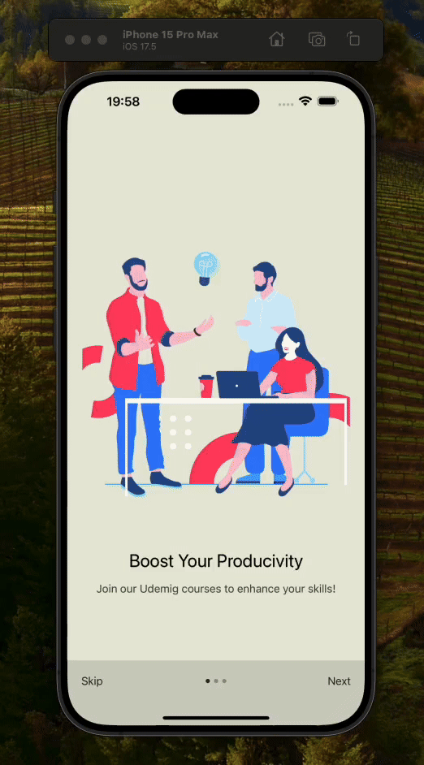

# React Native To-Do App

This project I developed with React Native is a simple To-Do application with onboarding, task management, and persistent data storage with AsyncStorage.

## Özellikler

- **Onboarding**: When users first open the application, they see the onboarding screen.
- **Task Management**: Kullanıcılar görev ekleyebilir, güncelleyebilir, tamamlayabilir veya silebilir.
- **Permanent Data Storage**: Tasks are stored locally using AsyncStorage and are not lost when the application is restarted.

## Screens

### Onboarding

- Yeni kullanıcılar için bir tanıtım akışı sağlar.
- Kullanıcılara dinamik bir deneyim sunmak için Lottie ile animasyon gösterir.
  Kullanıcılar onboarding sürecini atlayabilir veya tamamlayabilir.
- Onboarding tamamlandığında, durum Async

### Ana Ekran

- Onboarding tamamlandıktan sonra kullanıcıyı karşılayan ana ekran.
- Kullanıcılar To-Do listesine gidebilir veya onboarding durumunu sıfırlayabilir.

### To-Do

- Kullanıcılar görev ekleyebilir, düzenleyebilir, tamamlanmış olarak işaretleyebilir veya silebilir.
- Görevler AsyncStorage ile yerel olarak saklanır.

## Kullanılan Teknolojiler

- React Native
- React Navigation
- AsyncStorage
- Lottie
- LinearGradient

## Ekran Görüntüsü

